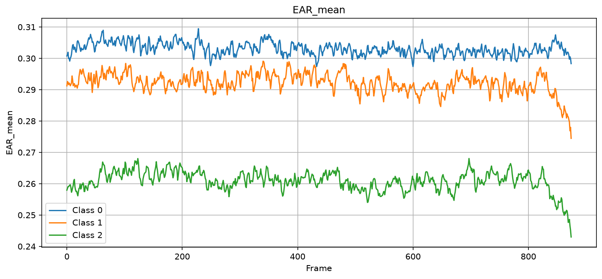
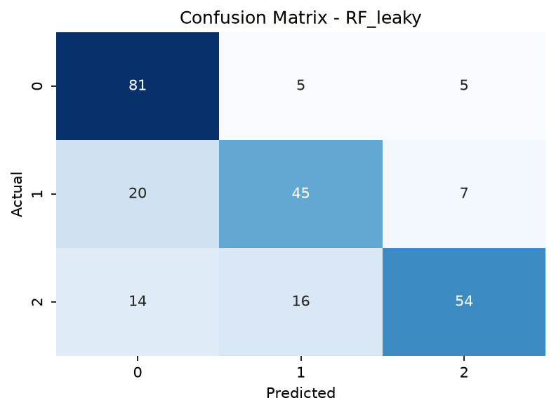
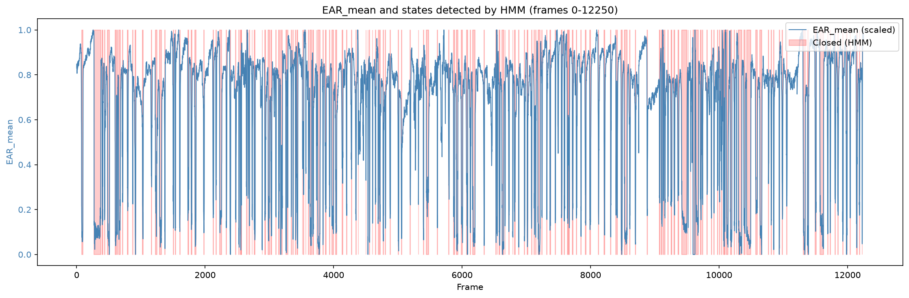
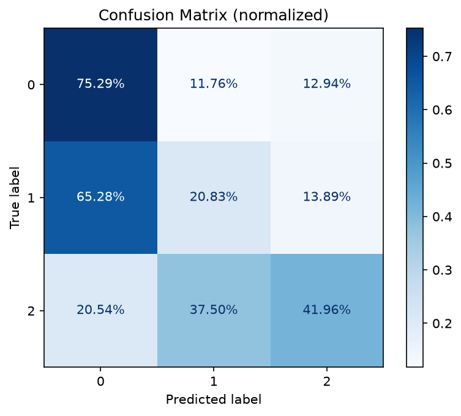
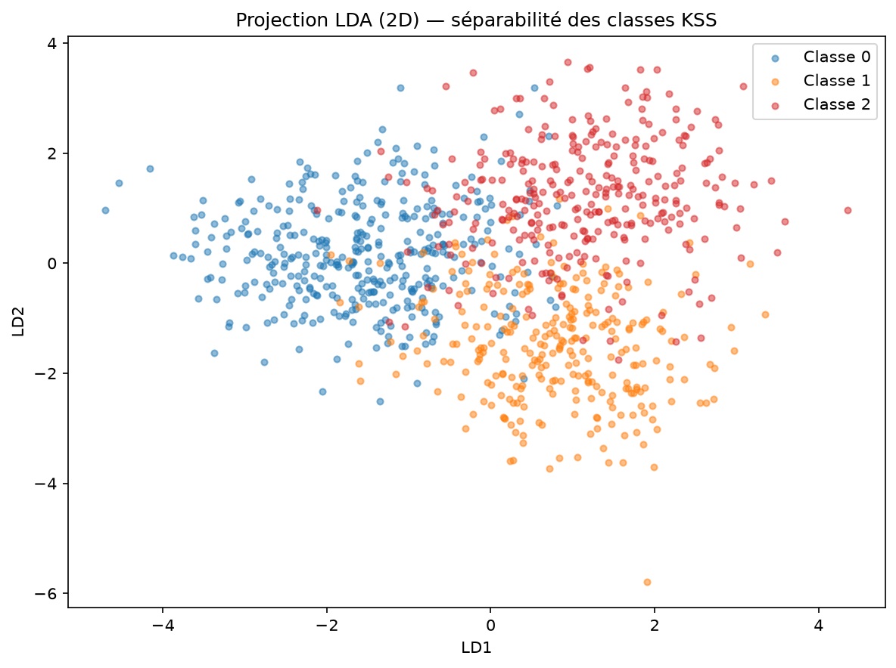

# Projet Industriel — Capgemini

## Détection de la somnolence au volant

Projet réalisé en 4e année de formation d'ingénieur à **Polytech Sorbonne**, spécialité **Mathématiques Appliquées et Informatique Numérique (MAIN)**, en partenariat avec **Capgemini**.

---

## Contexte et objectif

L'objectif de ce projet est de développer un système capable d'estimer le **niveau de somnolence d'un conducteur à partir d'un flux vidéo de son visage**.

Pour cela, plusieurs indicateurs comportementaux sont extraits du visage : l'ouverture des yeux, l'ouverture de la bouche et l'orientation de la tête. Ces indicateurs servent ensuite à prédire un niveau de somnolence basé sur la **Karolinska Sleepiness Scale (KSS)**, une échelle de référence en la matière, regroupée ici en **3 classes** (alerte, intermédiaire, somnolent).

---

## Démarche générale

Le pipeline complet peut se résumer ainsi :

```text
Vidéos
   │
   ▼
MediaPipe FaceLandmarker
   │
   ▼
Landmarks faciaux
   │
   ▼
Signes de fatigue
(EAR, MAR, HOP)
   │
   ├───────────────┐
   ▼               ▼
 tsfresh           HMM
   │               │
   │               ▼
   │       Signes dérivés
   │       (PERCLOS, clignements,
   │        durée des fermetures...)
   │               │
   └───────┬───────┘
           ▼
     Feature selection
           │
           ▼
     Random Forest
           │
           ▼
    Prédiction KSS
```

Ce projet consistait en une reprise d'un travail existant. En prenant le projet en main, j'ai d'abord identifié plusieurs problèmes méthodologiques dans l'approche initiale, avant d'y apporter des corrections et des améliorations. Ce README suit cette logique : je présente d'abord la construction du jeu de données, puis l'approche initiale et ses limites, et enfin les améliorations que j'ai mises en place.

---

# 1. Construction du jeu de données

Le projet s'appuie sur le dataset **RLDD (Real-Life Drowsiness Dataset)**, qui contient des vidéos de personnes présentant différents niveaux de somnolence, annotés selon l'échelle KSS.

Chaque vidéo est transformée en une série temporelle de caractéristiques faciales par le script `get_data.py`.

## Prétraitement vidéo

Les vidéos sont :

* ré-échantillonnées à **25 FPS** ;
* limitées à **875 frames**, soit **35 secondes** par vidéo ;
* analysées frame par frame avec **MediaPipe FaceLandmarker**.

Les landmarks suivants sont conservés :

* 8 points par œil ;
* 8 points pour la bouche ;
* 2 points pour l'orientation de la tête ;
* les coordonnées `x`, `y` et `z` de chaque point.

Les vidéos illisibles ou dont le taux de valeurs manquantes dépasse le seuil `NULL_RATIO_THRESHOLD` sont exclues.

Les coordonnées extraites par `src/process_videos.py` sont sauvegardées dans `csv/videos_coordinates.csv`.

## Extraction des signes de fatigue

À partir de ces landmarks, plusieurs indicateurs sont calculés par le script `src/signs.py`.

**EAR (Eye Aspect Ratio)** : mesure le niveau d'ouverture des yeux. Il est calculé séparément pour chaque œil (`EAR_left`, `EAR_right`), puis moyenné (`EAR_mean`). Une diminution de l'EAR traduit généralement une fermeture des yeux.

<p align="center"></p>

**MAR (Mouth Aspect Ratio)** : mesure le niveau d'ouverture de la bouche, ce qui permet notamment de détecter des épisodes pouvant correspondre à des bâillements.

**HOP (Head Orientation Parameters)** : décrit l'orientation de la tête à partir des landmarks sélectionnés, via deux signaux : `HOP_gd` et `HOP_hb`. Ils permettent de capturer certaines variations de posture.

**EBR et PERCLOS** : correspondent respectivement au nombre de clignements et au pourcentage de temps passé les yeux fermés. Ces indicateurs sont calculés à partir des variations de l'EAR sur les 35 secondes de chaque instance, avec un seuil de détection de l'œil fermé adapté à chaque personne , une adaptation nécessaire, car l'EAR varie naturellement d'un individu à l'autre (certaines personnes ont par exemple une ouverture des yeux naturellement plus importante que d'autres).

---

# 2. Approche initiale et problèmes identifiés

La première version du projet utilisait directement les séries temporelles extraites des vidéos : chaque instance contenait environ **7 000 features**, correspondant aux valeurs des différents signaux sur les 875 frames (par exemple `EAR_left_0, EAR_right_0, ..., HOP_hb_874`). Un **Random Forest** était ensuite entraîné directement sur ces données.

En reprenant le projet, j'ai identifié trois problèmes principaux dans cette approche.

## 2.1 Une fuite de données (data leakage)

Le dataset contient plusieurs instances issues d'une même vidéo. Le split initial était réalisé au niveau des instances, afin d'équilibrer les classes entre les jeux d'entraînement et de test. Mais cela pouvait conduire à une situation comme :

```text
Vidéo A
 ├── Instance 1 → Train
 ├── Instance 2 → Train
 └── Instance 3 → Test
```

Le modèle pouvait donc retrouver, dans le jeu de test, des données provenant d'une personne déjà rencontrée pendant l'entraînement, sur une autre partie de la même vidéo. Les données d'entraînement et de test n'étaient alors pas réellement indépendantes, ce qui conduisait à une **estimation trop optimiste des performances** du modèle.

<p align="center"></p>

## 2.2 Une représentation temporelle mal adaptée

Le Random Forest ne modélise pas explicitement la structure temporelle d'une série. Lui fournir directement plusieurs milliers de valeurs successives revient à traiter chaque frame comme une feature indépendante, ce qui est peu adapté à ce type de modèle. Il est préférable de transformer les séries temporelles en **descripteurs statistiques et temporels** résumant leur comportement.

## 2.3 Des données peu représentatives de la conduite réelle

Les vidéos du dataset sont enregistrées dans des conditions relativement contrôlées et ne reproduisent pas nécessairement les comportements d'une conduite réelle (vérification des rétroviseurs, mouvements de tête, changements de vitesse, variations de posture, etc.). Cette limite concerne le dataset lui-même et ne peut pas être corrigée uniquement par le choix du modèle.

---

# 3. Améliorations apportées

Pour répondre à ces problèmes, j'ai apporté plusieurs modifications, disponibles dans le fichier `train_RF_enhanced.ipynb`, afin de rendre l'évaluation plus robuste et la représentation des données plus adaptée.

## 3.1 Correction de la fuite de données : split par vidéo

Le train/test split et la validation croisée sont désormais réalisés au niveau des vidéos, avec `StratifiedGroupKFold` et `group = video_name`. Cela garantit qu'une même vidéo ne peut jamais apparaître à la fois dans l'entraînement et dans la validation, tandis que la stratification conserve une répartition similaire des classes entre les folds.

**Impact mesuré du data leakage** : j'ai comparé les deux stratégies sur le même modèle :

| Méthode | F1 weighted (CV) |
| --- | ---: |
| `StratifiedKFold` : split classique | **0,556 ± 0,059** |
| `StratifiedGroupKFold` : split par vidéo | **0,439 ± 0,036** |

L'écart entre les deux approches (0,556 − 0,439 = 0,117) montre que le split par instance surestimait nettement les performances réelles du modèle, ce qui confirme l'importance du regroupement par vidéo.

## 3.2 Une représentation temporelle plus adaptée : tsfresh

Plutôt que d'utiliser directement les milliers de valeurs brutes, les séries temporelles sont transformées en caractéristiques statistiques et temporelles à l'aide de la librairie **tsfresh** (`EfficientFCParameters`), appliquée aux six signaux `EAR_left`, `EAR_right`, `EAR_mean`, `MAR`, `HOP_gd` et `HOP_hb`.

Les caractéristiques extraites peuvent représenter, entre autres, la moyenne, la variance, l'écart-type, l'énergie, l'entropie, l'autocorrélation ou encore la dynamique du signal. Cela remplace une représentation de plusieurs milliers de valeurs brutes par un ensemble de descripteurs statistiques et temporels.

L'ensemble des features générées par tsfresh restant relativement important, une étape de **sélection statistique** est ensuite appliquée afin de réduire l'espace des paramètres et de ne conserver que les features les plus explicatives vis-à-vis de la classe.

## 3.3 Une détection d'état plus fine : Hidden Markov Model

Dans la version initiale, l'ouverture ou la fermeture des yeux était déterminée à partir d'un seuil adaptatif appliqué à l'EAR. Cette approche binaire ne permettait pas de représenter correctement les niveaux intermédiaires d'ouverture des yeux, et manquait de précision pour détecter certaines fermetures et certains clignements.

J'ai donc remplacé ce seuil par un **Gaussian Hidden Markov Model (HMM)**, chargé d'apprendre automatiquement les différents états du signal. Plusieurs nombres d'états ont été testés, le choix étant guidé par : le **BIC (Bayesian Information Criterion)**, la dispersion de l'état correspondant à une fermeture importante, et la capacité du modèle à représenter les différents niveaux d'ouverture des yeux. Un modèle à 2 états (« ouvert » / « fermé ») s'est révélé insuffisant pour capturer les variations intermédiaires ; un modèle à **10 états** a finalement été retenu comme compromis.

<p align="center"></p>

Les états prédits par le HMM permettent ensuite de calculer des indicateurs comportementaux de façon plus fiable qu'avec le seuil adaptatif. J'ai notamment calculé : le **PERCLOS**, le nombre de clignements, la durée moyenne des fermetures, l'écart-type de la durée des fermetures, et le nombre de bâillements. Ces informations sont ensuite combinées aux features extraites par tsfresh :

```text
Séries temporelles
      │
      ├───────────────┐
      ▼               ▼
   tsfresh            HMM
      │               │
      │               ▼
      │        Features comportementales
      │               │
      └───────┬───────┘
              ▼
       Feature selection
              │
              ▼
        Random Forest
```

## 3.4 Random Forest et recherche d'hyperparamètres

J'ai choisi de conserver un **Random Forest**, comme dans l'approche initiale, mais appliqué cette fois à une représentation des données bien plus adaptée à ce type d'algorithme.

Les hyperparamètres (`n_estimators`, `max_depth`, `max_features`) sont optimisés via `RandomizedSearchCV`, avec une validation croisée reposant elle aussi sur `StratifiedGroupKFold`, afin de conserver la séparation entre vidéos sur l'ensemble du processus d'entraînement.

## 3.5 Résultat de référence et analyse des erreurs

La performance de référence de l'approche finale est :

> **F1 weighted : 0,439 ± 0,036**

obtenue avec une validation croisée à 5 folds, un split groupé par vidéo, des features tsfresh sélectionnées, des features dérivées du HMM, et un Random Forest optimisé.

Afin de comprendre pourquoi cette nouvelle approche, plus rigoureuse, obtenait des performances inférieures à celles (biaisées) du modèle initial, j'ai mené une analyse des erreurs :

* **Matrice de confusion** : les principales erreurs concernent la classe intermédiaire (niveau 1), que le modèle a tendance à confondre avec les deux classes voisines.

<p align="center"></p>

* **Analyse LDA (Linear Discriminant Analysis)** : utilisée pour visualiser la séparabilité des classes dans l'espace des features, elle montre un chevauchement important entre les classes, particulièrement autour de la classe intermédiaire.

<p align="center"></p>

Ces observations suggèrent que les difficultés de classification ne proviennent pas uniquement du choix du Random Forest : une partie du plafond de performance semble provenir directement de la **séparabilité limitée des classes dans les données disponibles**.

---

# 4. Limites

**Un dataset peu représentatif de la conduite réelle** : les vidéos du dataset RLDD sont tournées face caméra, sujet immobile, dans des conditions contrôlées. Elles ne reproduisent donc pas les conditions réelles de conduite (vérification des rétroviseurs, mouvements de tête, changements de vitesse, variations de posture, environnement routier), ce qui limite la capacité du modèle à généraliser à un usage réel. Corriger cette limite nécessiterait une collecte de données dans des conditions plus proches de l'usage final.

**Dataset partiellement exploité** : le projet utilise actuellement environ 1,9 Go de vidéos, alors que le dataset RLDD complet en contient plus de 90 Go. En exploitant une plus grande partie de ce dataset, j'aurais probablement disposé de davantage de données pour mieux différencier les trois classes (0, 1, 2), notamment la classe intermédiaire, et pour permettre au modèle d'apprendre des caractéristiques plus robustes et généralisables à de nouveaux individus , une contrainte qui devient d'autant plus importante pour des modèles plus complexes nécessitant davantage de données, comme les GRU ou d'autres architectures séquentielles.

**Chevauchement entre classes** : les niveaux KSS adjacents peuvent présenter des caractéristiques faciales similaires, la classe intermédiaire étant particulièrement difficile à distinguer, comme le montrent la matrice de confusion et la projection LDA.

---

# Installation et utilisation

## Installation

Les dépendances nécessaires sont listées dans `requirements.txt`. Il convient de les installer via pip, dans un environnement Python, avant de lancer le projet.

## Extraction des landmarks et création du dataset

Le script

```bash
python get_data.py
```

constitue le **point d'entrée principal** pour la création du dataset. Il traite les vidéos présentes dans `videos/` et orchestre l'ensemble des étapes nécessaires. Pour chaque vidéo, il :

1. extrait les landmarks avec MediaPipe ;
2. vérifie la qualité des données ;
3. calcule les signes de fatigue à partir des landmarks ;
4. sauvegarde les données intermédiaires et finales ;
5. enregistre la vidéo comme traitée, afin d'éviter de la retraiter lors d'une prochaine exécution.

`get_data.py` fait appel aux scripts présents dans `src/`, notamment ceux utilisés pour l'extraction des landmarks et le calcul des différents signes de fatigue. Il n'est donc pas nécessaire d'exécuter manuellement chaque script de `src/` : **`get_data.py` orchestre ces différentes étapes automatiquement**.

Les coordonnées extraites sont sauvegardées dans `csv/videos_coordinates.csv`, et le dataset final contenant les signes de fatigue dans `csv/signes.csv`.

## Démonstrateur

Le démonstrateur doit encore être corrigé.

## Modèles

Les modèles entraînés sont disponibles dans `ML_Models`. Les scripts et notebooks associés permettent de retrouver les différentes étapes d'entraînement, de validation et d'analyse des modèles.

---

# Synthèse

Le projet a évolué d'une approche utilisant directement plusieurs milliers de valeurs temporelles brutes vers un pipeline plus structuré, combinant extraction de landmarks, calcul de signaux biométriques (EAR, MAR, HOP), extraction de features avec tsfresh, modélisation des états avec un HMM, sélection de features et classification par Random Forest.

Les principales améliorations apportées lors de la reprise du projet sont :

* la suppression du **data leakage**, grâce au split par vidéo ;
* une représentation temporelle plus adaptée, grâce à **tsfresh** ;
* une détection des états basée sur un **HMM** plutôt que sur des seuils manuels ;
* la création de nouvelles features comportementales à partir du HMM ;
* une sélection statistique des features ;
* une optimisation des hyperparamètres ;
* une analyse des erreurs permettant d'identifier les limites du dataset et la difficulté de séparation entre les classes.

La performance de référence actuelle est de **0,439 ± 0,036 en F1 weighted**, avec une validation croisée groupée par vidéo.